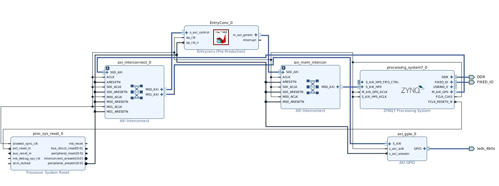
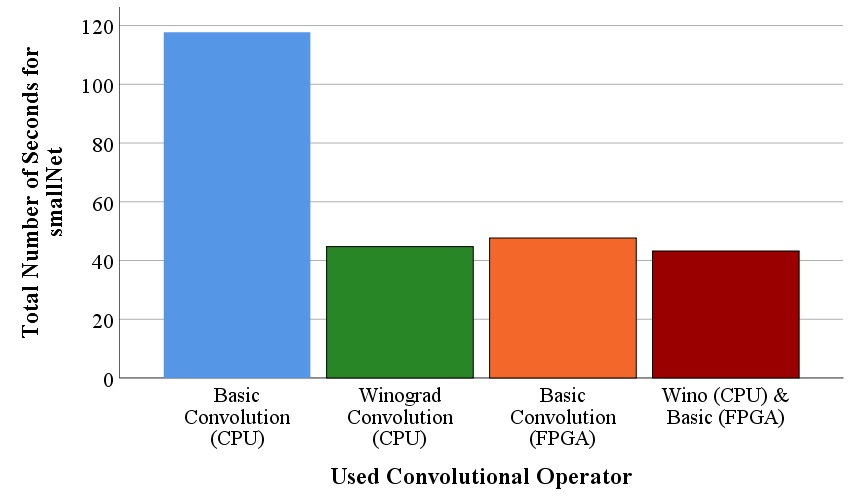
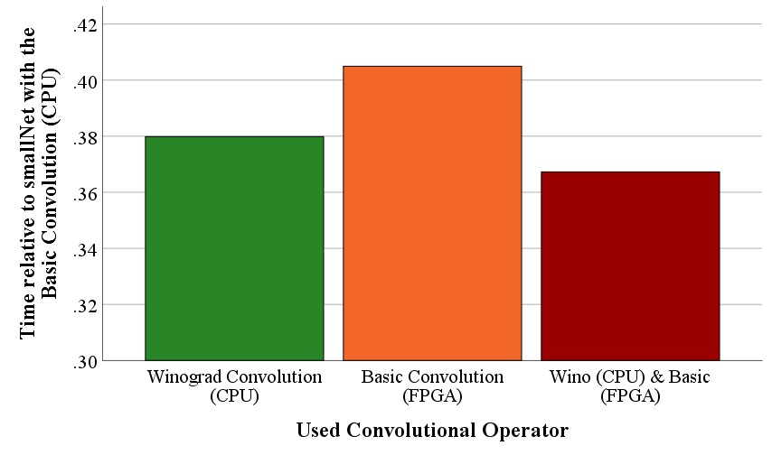
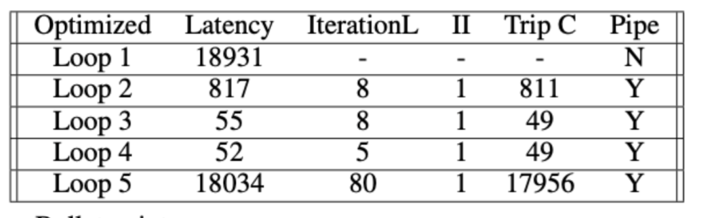
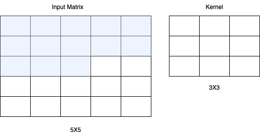

# This project is part of the practical course, which is "Accelerating Convolutional Neural Networks using Programmable Logic" at TUM.
Artificial Intelligence (AI) is a domain of research that already has disrupted many parts of our digital lives. To improve the energy-efficiency and performance of AI algorithms dedicated hardware becomes more and more important.

Today, a lot of AI classification is performed on the cloud, which allows big companies access to private data of end users. A focus on designing dedicated AI accelerators for end-user devices (on the "edge") could increase data security and privacy.

This project aims at bringing multiple teams from TUM and Uni Potsdam together to offer hybrid practical courses regarding the development of dedicated AI chips. The project has access to the unique opportunity for students to fabricate their own AI-chips due to the Partnership with Leibniz Institute for High Performance Microelectronics (IHP)


# Abstract:
In this project paper, we propose an accelerated Convolutional Neural Network (CNN) architecture designed specifically for the FPGA-based PYNQ Z2 development board. We explore the efficacy of fast convolutional operators, such as the Wino- grad and FFT convolutions. Since the complexities of these algorithms increase the difficulty of practical FPGA implementations, we focus on the traditional convolutional operator. The results of our work are highly promising, as we achieve a remarkable 2.7-fold overall speed-up by applying our optimizations to the CNN. Additionally, we suggest optimizations to further enhance efficiency. Our research demonstrates the potential of FPGA- accelerated deep learning, since the traditional con- volutional operator on the FPGA is only slightly slower than fast convolutions such as Winograd executed on a CPU.

# Report:
Please find the very detailed report of the project in here.
[Overall Report](acc_report.pdf)
# Project Structure:

* To run the Optimization HW&SW:
  * go to the `fpga_optimization` folder.
  * run the ```make``` command to compile the project.
  * run the ```./class.bin <net_select> <N>``` command to program the FPGA.
  * Since we implemented our implementation with SmallNet, write small_net for net_select.
  * N is the number of images that you want to test.
  

* To see the HLS side of the project:
  * Go to the `vitis` folder.
  * To run the code on the vitis_hls, copy them to your vitis_hls project.
  * Select `conv.cpp` and `conv.h` as source files and select `EntryConv` as the top function.
  * Select `tb.cpp` as the test bench file.
  * Generate a test case using the `gen_test.py` file in `test_case` folder.


* FFT, Winograd, and Direct convolution implementations are in the `inference` folder. If you want to test and benchmarked the implementations, please go to the `inference` folder:
  * run the ```python3 gentest.py``` to generate the test data.
  * run the ```./lab2.bin 0``` to test the implementations.
  * run the ```./lab2.bin 1``` to use it specific image.
  * run the ```./lab2.bin 2``` to  benchmark the implementations.


## Project Owners:
- [Christian Alexander Pesch](https://github.com/TheWreckTUM)
- [Utku Saglam](https://github.com/utkusaglm)
- [Nisse Degelin](https://github.com/nickatillinois)


## Detailed information about the project can be found in here [Course web Site](https://www.ce.cit.tum.de/caps/lehre/ss23/praktika/accelerating-convolutional-neural-networks-using-programmable-logic/).

# Some Figures from the Project(Can be found in the report):
**Implementation:**


**Total Time Absolute Comparison:**


**Total Time Relative Comparison:**


**Initiation Interval:**


**Line Buffer:**


